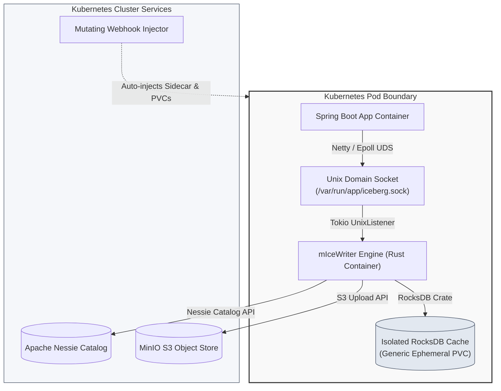

# 📥 micewriter-hub
> 🌐 Central architecture, system design, and IPC protocol hub for the **[mIceWriter Ingestion Ecosystem](file:///c:/Users/marko/source/repos/mmicewriter_design/README.md)**

This repository serves as the single source of truth for the system design, network topology, and architecture of the high-throughput, low-latency telemetry ingestion platform. It decouples standard Spring Boot applications from object-storage API latency by using a memory-safe Rust sidecar and local RocksDB caching.

---

## 🗺️ System Topology

This diagram visualizes how the components are structurally laid out inside the Kubernetes pod boundary and how they interface with external cluster services:

---

## 📚 Component Repositories

The system is broken down into five distinct repositories to maintain separation of concerns between platform infrastructure, library development, K8s administration, and application engineering.

| Component / Repository | Description | Tech Stack | Design Document |
| :--- | :--- | :--- | :--- |
| 🌐 **`micewriter-hub`** *(This repo)* | Central architecture, system design, and IPC protocol hub. | Markdown, Mermaid | [README.md](README.md) |
| 🦀 **`micewriter-engine`** | Memory-safe, high-throughput Rust sidecar engine for RocksDB caching. | Rust, Tokio, RocksDB, pyiceberg | [micewriter-engine.md](docs/micewriter-engine.md) |
| ☕ **`micewriter-sdk-java`** | Spring Boot Starter SDK providing Netty-based Unix Domain Socket IPC. | Java, Spring Boot, Netty, Epoll | [micewriter-sdk-java.md](docs/micewriter-sdk-java.md) |
| ☸️ **`micewriter-k8s-injector`** | Kubernetes Mutating Webhook to automate sidecar & volume injection. | Go (controller-runtime), TLS | [micewriter-k8s-injector.md](docs/micewriter-k8s-injector.md) |
| 🧪 **`micewriter-sandbox`** | Reference Spring Boot microservice demonstrating end-to-end telemetry. | Spring Boot, Docker, K8s manifests | [micewriter-sandbox.md](docs/micewriter-sandbox.md) |
| 🐳 **`micewriter-local-infra`**| Local data lake simulator packaging MinIO and Nessie Helm charts. | Helm, Kubernetes, MinIO, Nessie | [micewriter-local-infra.md](docs/micewriter-local-infra.md) |

---

## 🚀 Getting Started

Ready to deploy the full stack? The end-to-end guide covers everything from provisioning
the k3s cluster to verifying that Parquet files appear in MinIO after the first flush cycle:

👉 **[End-to-End Deployment Guide](docs/getting-started.md)**

---

## 📖 Deep Dives

To explore the low-level data flows, IPC protocol specifications, and background cron flush designs, proceed to the primary system documentation:

👉 **[View Detailed System Overview & IPC Protocol](docs/system-overview.md)**

---

## 💻 Local Multi-Root Workspace

To streamline development across all five repositories locally, a VS Code multi-root workspace file is provided. 

1. Clone all `micewriter-` repositories into the same parent folder.
2. Open VS Code.
3. Select **File > Open Workspace from File...** and choose **[micewriter.code-workspace](micewriter.code-workspace)**.

This will organize all five codebases into a unified explorer sidebar in your IDE.

---
### 🔗 The mIceWriter Ecosystem
* **Architecture Hub:** [micewriter-hub](file:///c:/Users/marko/source/repos/mmicewriter_design/README.md)
* **System Overview:** [system-overview](file:///c:/Users/marko/source/repos/mmicewriter_design/docs/system-overview.md)
* **Rust Sidecar Engine:** [micewriter-engine](file:///c:/Users/marko/source/repos/mmicewriter_design/docs/micewriter-engine.md)
* **Spring Boot SDK:** [micewriter-sdk-java](file:///c:/Users/marko/source/repos/mmicewriter_design/docs/micewriter-sdk-java.md)
* **Kubernetes Webhook:** [micewriter-k8s-injector](file:///c:/Users/marko/source/repos/mmicewriter_design/docs/micewriter-k8s-injector.md)
* **Local Data Lake Mock:** [micewriter-local-infra](file:///c:/Users/marko/source/repos/mmicewriter_design/docs/micewriter-local-infra.md)
* **Reference Testing App:** [micewriter-sandbox](file:///c:/Users/marko/source/repos/mmicewriter_design/docs/micewriter-sandbox.md)
