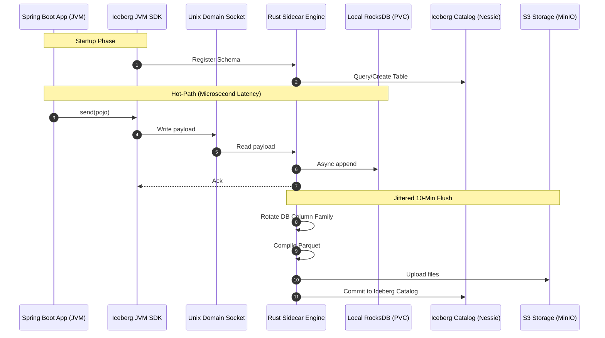

# mmicewriter_design

**Architecture and Design Hub for the Distributed Iceberg Ingestion Pipeline**

This repository serves as the single source of truth for the system design, network topology, and architecture of the high-throughput, low-latency telemetry ingestion platform. It decouples standard Spring Boot applications from object-storage API latency by using a memory-safe Rust sidecar and local RocksDB caching.

---

## 🗺️ System Architecture

To understand how data flows from the business application, across the Unix Domain Socket, and into the Apache Iceberg Catalog, start with the core architecture document:

👉 **[View System Overview & UDS Protocol](docs/system-overview.md)**

---

## 📚 Component Repositories

The system is broken down into five distinct repositories to maintain separation of concerns between platform infrastructure, library development, K8s administration, and application engineering.

| Component / Repository | Owner | Tech Stack | Design Document |
| :--- | :--- | :--- | :--- |
| **`iceberg-sidecar-engine`** | Platform Core | Rust, Tokio, RocksDB | [sidecar-engine.md](docs/sidecar-engine.md) |
| **`iceberg-spring-boot-starter`**| Developer SDK | Java, Spring, Netty | [spring-boot-starter.md](docs/spring-boot-starter.md) |
| **`local-datalake-infra`** | Local Dev Env | Helm, Nessie, MinIO | [local-datalake.md](docs/local-datalake.md) |
| **`telemetry-sandbox-app`** | App Engineering | Spring Boot, K8s | [sandbox-app.md](docs/sandbox-app.md) |
| **`iceberg-sidecar-injector`** | K8s Admin | Go, Webhooks | [sidecar-injector.md](docs/sidecar-injector.md) |

---
