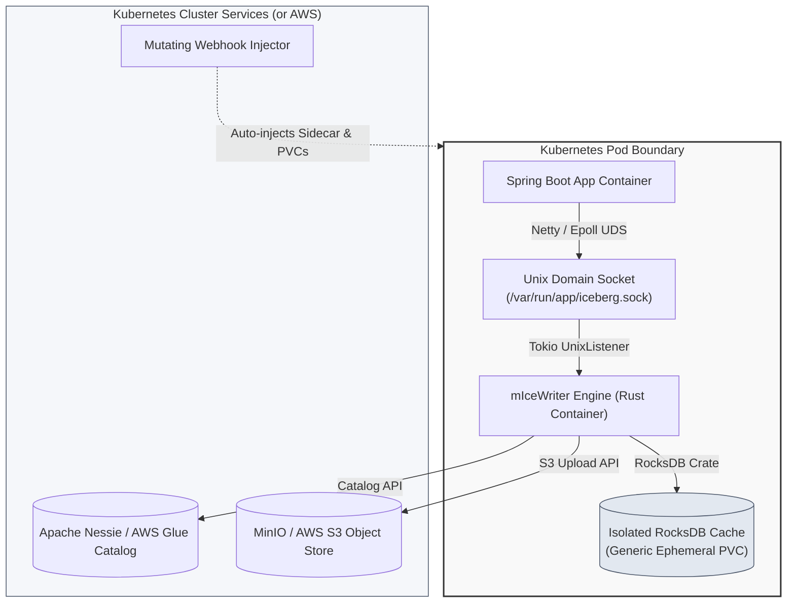

# 📥 micewriter-hub
> 🌐 Architecture, motivation, and feasibility evaluation for the **mIceWriter Ingestion Ecosystem** — a sidecar that lets EKS-deployed apps persist to Apache Iceberg without blocking the hot path or burdening their JVM.

mIceWriter is an **opt-in sidecar** for applications running on AWS EKS (or any Kubernetes cluster) that need to persist telemetry, audit, or model-payload data to Apache Iceberg tables — without paying S3 latency on the hot path, without buffering large payloads in their own JVM heap, and without flooding S3 with tiny files that ruin downstream query performance.

Adoption is a single pod annotation. A mutating webhook injects the engine sidecar, a shared Unix Domain Socket, and an ephemeral RocksDB cache. The application talks to the sidecar locally over UDS; the sidecar absorbs writes at microsecond latency and asynchronously consolidates them into Parquet files committed to the Iceberg catalog (AWS Glue in production, Apache Nessie locally).

---

## 🧭 How to read this hub

This repository is documentation-only. It answers three questions, in this order:

| Lens | Question | Start here |
|---|---|---|
| 🎯 **Why** | What problem does this solve, who is it for, and what are the non-goals? | **[docs/why.md](docs/why.md)** |
| 🛠️ **What** | How is it built — system architecture, components, wire protocol? | **[docs/system-overview.md](docs/system-overview.md)** |
| 🔬 **Is it viable?** | At what throughputs and payload sizes does the engine fit in a reasonable CPU/memory envelope per pod? | **[docs/feasibility.md](docs/feasibility.md)** |

If you are deciding whether to adopt the sidecar in your own application, start with **Why**. If you are implementing or reviewing the design, start with **What**. If you are deciding whether to recommend this to other teams, start with **Is it viable?**.

---

## 🗺️ System topology

The system operates entirely within the Kubernetes pod networking boundary, ensuring zero network latency for the business application during data emission:

---

## 📚 Component repositories

The system is broken down into six repositories along separation-of-concerns lines. Three are the runtime system (`engine`, `sdk-java`, `k8s-injector`). The other three exist to evaluate the runtime system locally before recommending it for production EKS (`local-infra`, `sandbox`, plus the load-testing spec hosted in this hub).

| Lens | Repository | Description | Stack | Doc |
|---|---|---|---|---|
| 🧭 Meta | 🌐 **`micewriter-hub`** *(this repo)* | Architecture, motivation, feasibility eval — introduces all three lenses | Markdown, Mermaid | [README.md](README.md) |
| 🛠️ What | 🦀 **`micewriter-engine`** | Memory-safe Rust sidecar managing RocksDB buffer and Iceberg commits | Rust, Tokio, RocksDB, iceberg-rust | [micewriter-engine.md](docs/micewriter-engine.md) |
| 🛠️ What | ☕ **`micewriter-sdk-java`** | Java SDK (Spring Boot + Dropwizard) with Netty UDS transport | Java, Netty, CBOR | [micewriter-sdk-java.md](docs/micewriter-sdk-java.md) |
| 🛠️ What | ☸️ **`micewriter-k8s-injector`** | Mutating Admission Webhook for auto-injection of sidecar + volumes | Go (k8s.io/api), TLS | [micewriter-k8s-injector.md](docs/micewriter-k8s-injector.md) |
| 🔬 Viable? | 🐳 **`micewriter-local-infra`** | Local data-lake stand-in (MinIO + Nessie) on k3s | Helm, Kubernetes | [micewriter-local-infra.md](docs/micewriter-local-infra.md) |
| 🔬 Viable? | 🧪 **`micewriter-sandbox`** | Reference Spring Boot app driving load against the local engine | Spring Boot, Docker | [micewriter-sandbox.md](docs/micewriter-sandbox.md) |

---

## 💻 Local multi-root workspace

To streamline development across all repositories, a VS Code multi-root workspace file is provided.

1. Clone all `micewriter-` repositories into the same parent folder.
2. Open VS Code.
3. Select **File > Open Workspace from File...** and choose **[micewriter.code-workspace](micewriter.code-workspace)**.

This organizes all codebases into a unified explorer sidebar in your IDE.

---

### 🔗 The mIceWriter Ecosystem

**🎯 Why:**
* [Motivation & target adopter](docs/why.md)

**🛠️ What:**
* [System overview & IPC protocol](docs/system-overview.md)
* [System limits & backpressure analysis](docs/limits-and-backpressure.md)
* [Rust sidecar engine](docs/micewriter-engine.md)
* [Java SDK](docs/micewriter-sdk-java.md)
* [Kubernetes injector](docs/micewriter-k8s-injector.md)

**🔬 Is it viable?**
* [Feasibility evaluation](docs/feasibility.md)
* [Getting started (local deploy)](docs/getting-started.md)
* [Local infrastructure](docs/micewriter-local-infra.md)
* [Reference sandbox app](docs/micewriter-sandbox.md)
* [Load testing specification](docs/load-testing-spec.md) — driven by the sandbox's `/loadtest/{start,sweep,{runId},{runId}/stop}` endpoints ([reference](../micewriter-sandbox/README.md#loadtest--in-process-load-generator))

**📊 Use:**
* [Querying Iceberg tables](docs/querying.md)
