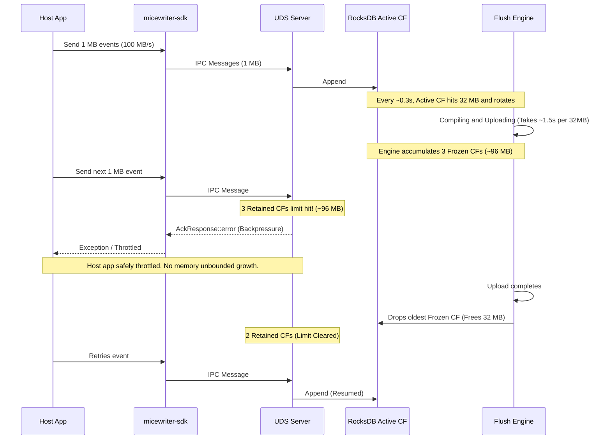

# System Limits and Backpressure

This document explains the limits applied by the `micewriter-sdk` and `micewriter-engine` as telemetry data flows from the host application to the Iceberg tables. It outlines the intentional constraints, the mechanisms for backpressure, and a critical flaw in the current backpressure implementation.

> [!NOTE]
> For a mathematical derivation of how these limits translate into expected system throughput, see the [Effective Throughput Model](throughput-model.md).

## 1. Intentional Limits

### SDK & IPC Payload Limit (16 MB)
Both the Java SDK and the Rust Engine enforce a strict `MAX_PAYLOAD_BYTES` limit of **16 MB** for any single IPC message (`INGEST_RECORD`). 
* If a single POJO serializes to > 16 MB, the SDK throws an `IllegalArgumentException` and drops the message before sending it over the Unix Domain Socket.
* If the Engine receives an IPC frame larger than 16 MB, it drops the connection to prevent memory exhaustion attacks.

### RocksDB Write Batching Limits
To efficiently persist incoming IPC records, the UDS server opportunistically batches messages before appending them to the active RocksDB column family. A write batch is flushed to disk when it reaches either:
* **`WRITE_BATCH_MAX`**: **1,000 records**.
* **`MAX_PAYLOAD_SIZE`**: **16 MB** total payload bytes.
This maximizes RocksDB throughput while preventing OOM crashes on bursts of large payloads.

### Engine Compilation Limits
During the flush cycle, the Engine reads the raw CBOR bytes from a frozen RocksDB column family and compiles them into Arrow/Parquet. To prevent out-of-memory (OOM) crashes on massive tables, it buffers data into chunks before writing to the `ArrowWriter`:
* **`flush_compile_batch_size`**: Default **1,000 records**.
* **`flush_compile_batch_bytes`**: Default **4 MB** (uncompressed CBOR).
Whichever limit is hit first forces the Engine to flush the current Arrow batch to Parquet and clear its memory buffers.

### Flush Intervals
Data is normally flushed based on a jittered cron loop to prevent all microservices from hitting the S3/Nessie catalog simultaneously.
* **Base Interval**: 10 minutes (`FLUSH_INTERVAL_SECS` = 600)
* **Jitter**: ± 2 minutes (`FLUSH_JITTER_SECS` = 120)
* A flush cycle rotates the active RocksDB column family, compiles all frozen CFs, uploads to MinIO, and commits to Nessie.

## 2. RocksDB Rotation & Backpressure Limits

The Engine buffers incoming IPC messages in a durable local RocksDB "active" Column Family. To prevent this buffer from growing indefinitely between periodic flushes, the engine defines a size limit:
* **`flush_size_bytes`**: Default **32 MB**.
* **`flush_size_jitter_bytes`**: Default **8 MB**.

When the active CF size exceeds a randomized threshold between **24 MB** and **40 MB** (jitter), the engine rotates the CF (freezing it) and immediately triggers an asynchronous flush. 

To protect the Engine's memory without unnecessarily throttling the host application, the engine enforces two global backpressure limits:
* **Retained CF Count**: Reject traffic if the number of frozen CFs pending flush reaches `MAX_RETAINED_FROZEN_CFS` (default 3).
* **Total Unflushed Bytes**: Reject traffic if the exact byte size of all uncompiled records (active + frozen) exceeds `config.flush_size_bytes * (1 + MAX_RETAINED_FROZEN_CFS)` (e.g., 128 MB).

Because the Retained CF Count triggers the moment the 3rd CF is frozen, the active CF is entirely blocked from accepting new data. Therefore, the system effectively hits backpressure at exactly the size of 3 frozen CFs (expected **~96 MB**), making the 128 MB limit a fallback shadow limit.

---

## 3. Scenarios Walkthrough

To understand the impact of the limits and the backpressure bug, let's explore two throughput scenarios.

### Scenario 1: Low Throughput (1 KB events at 10 events/sec)

* **Throughput**: 10 KB / sec (0.6 MB / minute).
* **Payload Limit**: 1 KB is well under the 16 MB limit.
* **Rotation**: In 10 minutes, the active CF accumulates ~6 MB of data. This is far below the 24–40 MB rotation limit, so size-based rotation never triggers.
* **Flush Phase**: The periodic timer wakes up every ~8–12 minutes, rotates the 6 MB active CF, and compiles it. The compile batch limits process 1000 records (1 MB) at a time, keeping memory low.
* **Backpressure**: During the flush, `total_unflushed_bytes` is 6 MB (frozen) + 0 MB (new active). This is well below the 32 MB backpressure limit. 
* **Result**: The system runs flawlessly, efficiently batching events and committing them to Iceberg without ever applying backpressure to the host app.

### Scenario 2: High Throughput (1 MB events at 100 MB/sec)

* **Throughput**: 100 MB / sec.
* **Payload Limit**: 1 MB is under the 16 MB limit.
* **The Reality (I/O Bottleneck)**:
  At 100 MB/sec, the active CF hits its 32 MB limit and rotates every ~0.3 seconds. However, the background `flush_engine` takes several seconds to compile 32 MB of CBOR into Parquet, upload it to MinIO, and commit it to Nessie.
* **Healthy Backpressure in Action**:
  1. The engine rapidly accumulates 3 frozen CFs (expected ~96 MB depending on rotation jitter).
  2. As the 3rd CF freezes, the `MAX_RETAINED_FROZEN_CFS` limit is instantly hit. The new active CF is blocked at 0 bytes.
  3. The Engine gracefully enters backpressure and rejects incoming IPC messages.
  4. The host application is throttled (receives IPC errors) but the sidecar's memory is perfectly protected from OOM-killing.
* **Result**: The engine sustainably flushes at its maximum possible I/O speed (~15-20 MB/sec depending on CPU/network) and safely rejects the excess 80 MB/sec of traffic without ever deadlocking.

