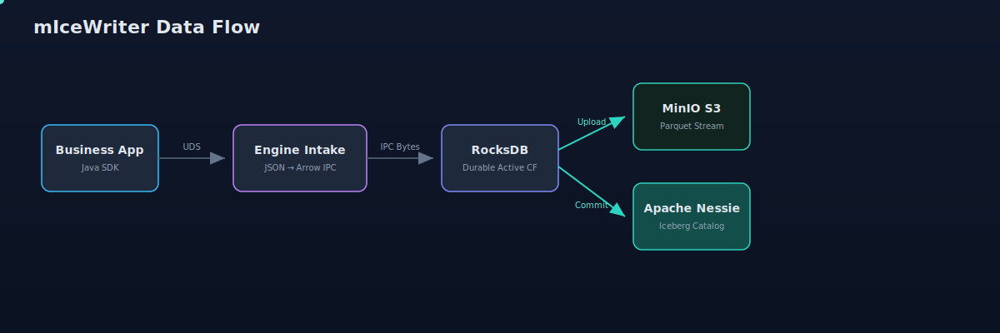
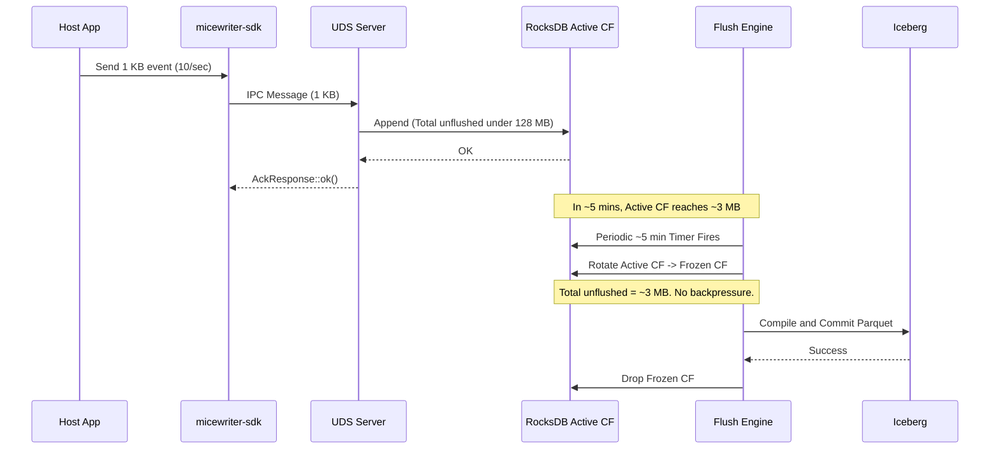
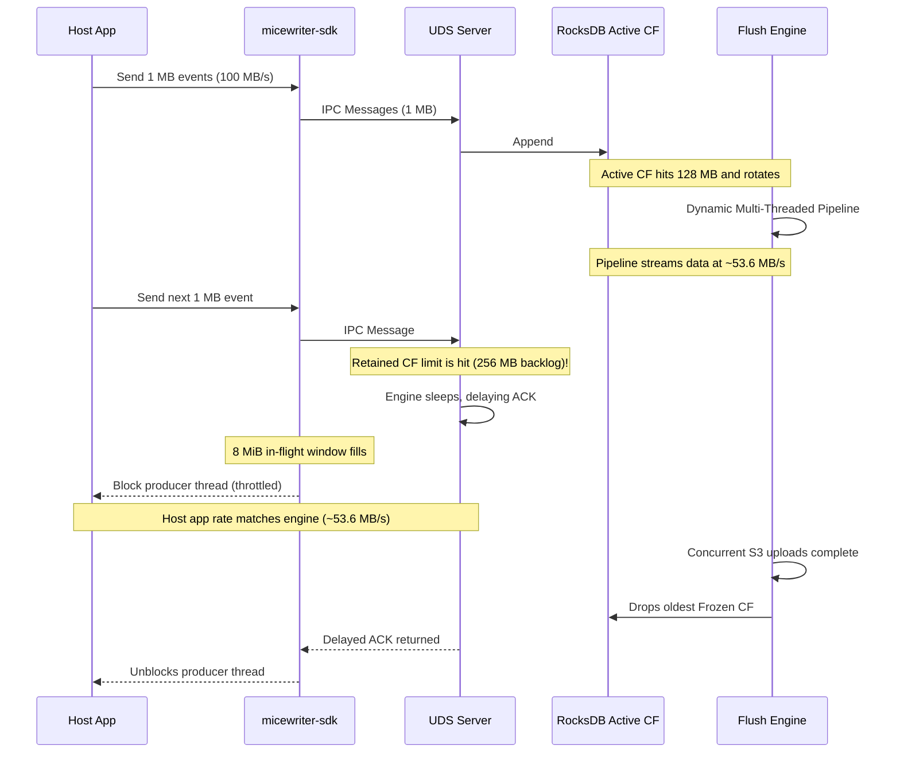

# System Limits and Backpressure

This document explains the limits applied by the `micewriter-sdk` and `micewriter-engine` as telemetry data flows from the host application to the Iceberg tables. It outlines the intentional constraints and the mechanisms for backpressure.

> [!NOTE]
> For a mathematical derivation of how these limits translate into expected system throughput, see the [Effective Throughput Model](throughput-model.md).

## Engine configuration constants

This table is the **canonical source of truth** for the engine's tunables. Every value below is read in `micewriter-engine`'s `config.rs` (or is a compile-time constant). Other documents in this hub link here rather than restating these numbers — if the code changes, update this table and nothing else needs to follow.

| Constant | Env var | Default | Meaning |
|---|---|---|---|
| Flush interval | `FLUSH_INTERVAL_SECS` | **300 s (5 min)** | Base period of the jittered background flush timer |
| Flush jitter | `FLUSH_JITTER_SECS` | **±60 s (±1 min)** | Desynchronizes pods → effective interval 240–360 s |
| CF rotation size | `FLUSH_SIZE_BYTES` | **128 MB** | Active column family rotates (freezes) at this size |
| Rotation size jitter | `FLUSH_SIZE_JITTER_BYTES` | **64 MB** | Rotation fires at a uniform-random 64–192 MB (mean 128 MB) |
| Per-message cap | `MAX_PAYLOAD_SIZE` | **16 MB** | Max single IPC frame; also the write-batch byte cap |
| Write batch max | *(const)* | **1 000 records** | Records coalesced per RocksDB write batch |
| Retained frozen CFs | `MAX_RETAINED_FROZEN_CFS` | **2** | Backpressure once this many frozen CFs await flush |
| Hard unflushed limit | *derived* | **384 MB** | `FLUSH_SIZE_BYTES × (1 + MAX_RETAINED_FROZEN_CFS)`; effective backpressure ≈ 256 MB |
| UDS ingest channel depth | *(const)* | **8** | Bounds in-flight intake bytes |
| Flush pipeline queue depth | *(const)* | **2** | Double-buffered flush pipeline channels |
| Parquet row-group bytes | `PARQUET_ROW_GROUP_BYTES` | **8 MiB** | Row groups roll at this size; rows-per-group derived per-table from average record size |
| Target Parquet file size | `TARGET_PARQUET_BYTES` | **64 MiB** | Output file roll target (set to `128Mi` for Trino-optimized files) |
| Parquet compression | `PARQUET_COMPRESSION` | **SNAPPY** | `NONE` \| `SNAPPY` \| `ZSTD` |
| Manual flush | `ENABLE_MANUAL_FLUSH` | **true** | Exposes the `FLUSH_NOW` IPC command (disable in production) |
| RocksDB fsync | `ROCKSDB_SYNC_WRITES` | **true** | fsync each write batch before ACK |
| Socket path | `SOCKET_PATH` | `/var/run/app/iceberg.sock` | Shared UDS path |
| RocksDB path | `ROCKSDB_PATH` | `/var/lib/rocksdb` | RocksDB data directory (ephemeral PVC) |
| Catalog | `CATALOG_TYPE` | `nessie` | `nessie` (Iceberg REST) or `glue` |
| Warehouse | `WAREHOUSE` (fallback `NESSIE_WAREHOUSE`) | `s3://iceberg` | Iceberg warehouse prefix |
| Memory limit | `ENGINE_MEM_LIMIT_BYTES` | 512 MiB | Drives dynamic sizing of batches/buffers/concurrency |

RocksDB additionally runs with **Direct I/O** (`set_use_direct_reads` + `set_use_direct_io_for_flush_and_compaction`) and **SST compression disabled** (`DBCompressionType::None`); block checksums use hardware CRC32C where the CPU exposes it.

## 1. Intentional Limits

### SDK & IPC Payload Limit (16 MB)
Both the Java SDK and the Rust Engine enforce a strict `MAX_PAYLOAD_BYTES` limit of **16 MB** for any single IPC message (`INGEST_RECORD`). 
* If a single POJO serializes to > 16 MB, the SDK throws an `IllegalArgumentException` and drops the message before sending it over the Unix Domain Socket.
* If the Engine receives an IPC frame larger than 16 MB, it drops the connection to prevent memory exhaustion attacks.

### SDK Client-Side In-Flight Window (`sendAsync`)
The pipelined `IcebergStreamTemplate.sendAsync()` path keeps multiple records in flight before their ACKs, so it needs its own memory guard. The SDK caps the total bytes of un-ACKed sends at **`max-in-flight-bytes`** (default **8 MiB**). When the window is full, the calling thread blocks until inbound ACKs free space — *client-side* backpressure that throttles the producer **before** records accumulate in the host-app heap. This bounds the SDK's footprint regardless of how far behind the engine falls. (The blocking `send()` path is implicitly limited to a single record in flight.) This limit is independent of, and sits upstream from, the engine-side backpressure in §2 — note it bounds **memory, not CPU**: a host pushing N records/sec still pays N records/sec of serialization cost.

### RocksDB Write Batching Limits
To efficiently persist incoming IPC records, the UDS server opportunistically batches messages before appending them to the active RocksDB column family. A write batch is flushed to disk when it reaches either:
* **`WRITE_BATCH_MAX`**: **1,000 records**.
* **`MAX_PAYLOAD_SIZE`**: **16 MB** total payload bytes.
This maximizes RocksDB throughput while preventing OOM crashes on bursts of large payloads.

### Intake and Pipeline Queue Limits
To prevent out-of-memory (OOM) crashes from excessive read-ahead buffering:
* **UDS Ingest Channel**: Capped at depth **8**. With large ~2.4MB JSON frames, this strictly bounds the intake memory.
* **Pipeline Queue Depth**: The flush pipeline channels are double-buffered (depth **2**) to prevent memory exhaustion when reading from RocksDB faster than S3 can upload.
* **Parquet Row Groups**: Instead of accumulating full files in memory, the streaming engine rolls Parquet row groups at **8 MiB** (`PARQUET_ROW_GROUP_BYTES`; the rows-per-group count is derived per-table from the average record size, not a fixed constant), allowing garbage collection of Arrow arrays while the multipart upload streams.

### Flush Intervals
Data is normally flushed based on a jittered cron loop to prevent all microservices from hitting the S3/Nessie catalog simultaneously.
* **Base Interval**: 5 minutes (`FLUSH_INTERVAL_SECS` = 300)
* **Jitter**: ± 1 minute (`FLUSH_JITTER_SECS` = 60)
* A flush cycle rotates the active RocksDB column family, compiles all frozen CFs, uploads to MinIO, and commits to Nessie.

## 2. RocksDB Rotation & Backpressure Limits

The Engine buffers incoming IPC messages in a durable local RocksDB "active" Column Family. To prevent this buffer from growing indefinitely between periodic flushes, the engine defines a size limit:
* **`flush_size_bytes`**: Default **128 MB**.
* **`flush_size_jitter_bytes`**: Default **64 MB**.

When the active CF size exceeds a randomized threshold between **64 MB** and **192 MB** (jitter, mean 128 MB), the engine rotates the CF (freezing it) and immediately triggers an asynchronous flush. 

To protect the Engine's memory without unnecessarily throttling the host application, the engine enforces two global backpressure limits:
* **Retained CF Count**: Reject traffic if the number of frozen CFs pending flush reaches `MAX_RETAINED_FROZEN_CFS` (default 2).
* **Total Unflushed Bytes**: Reject traffic if the exact byte size of all uncompiled records (active + frozen) exceeds `config.flush_size_bytes * (1 + MAX_RETAINED_FROZEN_CFS)` (e.g., 384 MB).

Because the Retained CF Count triggers the moment the 2nd CF is frozen, the active CF is entirely blocked from accepting new data. Therefore, the system effectively hits backpressure at exactly the size of 2 frozen CFs (expected **~256 MB**), making the 384 MB limit a fallback shadow limit.

---

## 3. Scenarios Walkthrough

To understand the impact of the limits and the backpressure bug, let's explore two throughput scenarios.

### Scenario 1: Low Throughput (1 KB events at 10 events/sec)

* **Throughput**: 10 KB / sec (0.6 MB / minute).
* **Payload Limit**: 1 KB is well under the 16 MB limit.
* **Rotation**: In 5 minutes, the active CF accumulates ~3 MB of data. This is far below the 64–192 MB rotation threshold, so size-based rotation never triggers.
* **Flush Phase**: The periodic timer wakes up every ~4–6 minutes, rotates the 3 MB active CF, and compiles it. The compile batch limits process records in dynamically sized batches, keeping memory safely bounded.
* **Backpressure**: During the flush, `total_unflushed_bytes` is 3 MB (frozen) + 0 MB (new active). This is well below the 384 MB backpressure limit. 
* **Result**: The system runs flawlessly, efficiently batching events and committing them to Iceberg without ever applying backpressure to the host app.

### Scenario 2: High Throughput (1 MB events at 100 MB/sec)

* **Throughput**: 100 MB / sec.
* **Payload Limit**: 1 MB is under the 16 MB limit.
* **The Reality (Dynamic Hardware-Aware Pipelining)**:
  At 100 MB/sec, the active CF hits its 128 MB limit and rotates every ~1.3 seconds. The background `flush_engine` uses a double-buffered pipelined architecture (queue depth=2) to stream the Arrow IPC data into Iceberg Parquet files. At `conc=2` under a 512Mi pod limit, the pipeline sustains **~53.6 MB/s**.
* **Healthy Backpressure in Action**:
  1. Because the host application generates data faster (100 MB/s) than the engine can process it (~53.6 MB/s), the engine begins accumulating frozen CFs.
  2. Within a few seconds, the `MAX_RETAINED_FROZEN_CFS` limit of 2 (and the 384 MB shadow limit) is hit.
  3. Instead of actively rejecting payloads, the engine enters a `sleep` loop, intentionally delaying ACKs back to the client. 
  4. The delayed ACKs cause the SDK's pipelined `sendAsync()` in-flight window (capped at 8 MiB) to quickly fill up. Once full, the SDK gracefully **blocks** the host application's producer thread.
  5. The host application's generation rate is perfectly capped to match the engine's exact drain rate (~53.6 MB/s), resulting in **zero failures or dropped payloads**. The engine's memory safely rides under 512Mi.
* **Result**: The engine smoothly sustains ~53.6 MB/s of ingestion without dropping the pod, gracefully throttling the host application via full-stack backpressure.

---

## 4. Durability Model

RocksDB here is a **transient local buffer**, not the system of record. A record only becomes durable when the engine **flushes it to Iceberg/MinIO (S3)** on the periodic cycle (§1, ~5 min ± jitter). At any instant there is therefore an in-flight window — up to roughly one flush interval of ingested data — that exists *only* inside the engine and is not yet durable in object storage.

### What an ACK means
The engine ACKs the SDK after the RocksDB `WriteBatch` commit (`rocksdb_store.rs` `append_batch`), **not** after the S3 flush. So `AckResponse::ok()` means "buffered in the engine," not "durable in Iceberg." The SDK keeps no copy after the ACK (and drops under backpressure — see §2–§3), so this is an intentionally **bounded best-effort** telemetry path, not exactly-once.

### What fsync (`ROCKSDB_SYNC_WRITES`) actually protects
The WAL is always enabled; `ROCKSDB_SYNC_WRITES` (default **true**) only controls whether each batch is **fsync'd** before the ACK (`rocksdb_store.rs` `wo.set_sync(...)`).

| Failure | fsync **on** | fsync **off** |
|---|---|---|
| Engine process crash / OOMKill / container restart (node stays up) | no loss | **no loss** — the WAL write is already in the OS page cache; the kernel survives the process death and RocksDB replays the WAL on restart |
| Node power loss / kernel panic | unflushed-to-S3 window at risk (see below) | additionally loses the un-fsync'd WAL tail |

So the common failure — the engine container restarting — is covered by **WAL replay regardless of fsync**. fsync only adds protection against a whole-node power loss.

### Why fsync buys little here: the RocksDB volume is pod-ephemeral
The injector mounts RocksDB on a **generic ephemeral volume** (`micewriter-k8s-injector` `injector.go` `ephemeralVolume()`, storageClass `local-path`): the PVC is **created and destroyed with the pod**, and `local-path` is node-local. So:
- It survives a **container** restart (which is why crash recovery works) but is **destroyed on pod reschedule**.
- On the one failure fsync guards against (node power loss / kernel panic), the pod is recreated — typically with a fresh ephemeral PVC and/or on another node — so the **entire buffered RocksDB dataset is lost regardless of fsync**.

Net: in this topology fsync-on protects only the razor-thin case of "power loss but the exact same pod resumes in place on the same node," while costing roughly **~1.5× write throughput** on the RocksDB write path (and even with fsync off, the write path is then capped by the single-writer serialization, not by fsync). Whether that trade earns the default is tracked in [`markovarghese/micewriter-engine#2`](https://github.com/markovarghese/micewriter-engine/issues/2).

### If stronger durability is required
Toggling fsync is the wrong lever in this topology. The effective options are: (a) **shorten the flush interval** to shrink the at-risk window; (b) put RocksDB on a **node-persistent** volume + node affinity so the buffer survives reschedule — *then* fsync genuinely matters; or (c) add **app-side at-least-once** with replay above the SDK.
