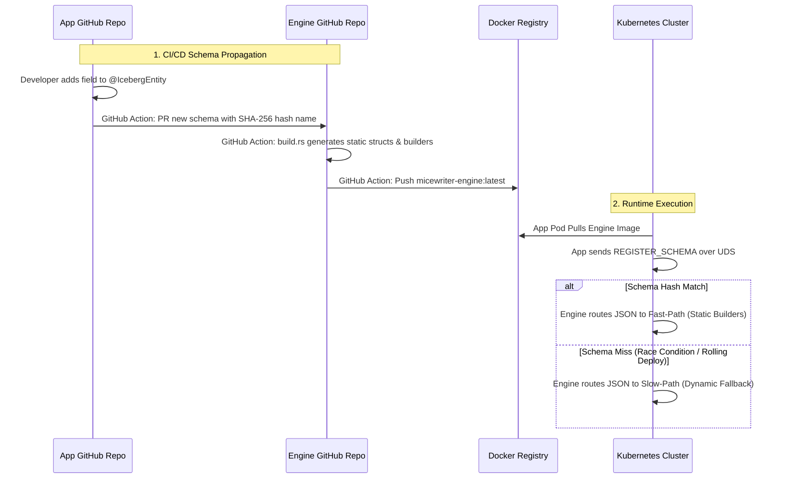

# 🚀 Architecture: Megamod Optimization Cache (AOT Schema Compilation)

> [!WARNING]
> **ABANDONED ARCHITECTURE:** This document outlines a *theoretical* architectural upgrade that was formally abandoned. The system currently relies entirely on dynamic JSON multi-threading, which was proven in load testing to easily saturate cluster network limits while remaining perfectly memory-bounded. The complexity of AOT schema compilation is no longer necessary.

## 🎯 The Original Goal
The objective of this architecture was to achieve the "Holy Grail" of sidecar performance: **True Zero-Copy `JSON → Static Arrow Parquet` pipeline**.
By statically compiling Ahead-Of-Time (AOT) Arrow ArrayBuilders for known schemas into the `micewriter-engine`, we aimed to completely eliminate dynamic AST parsing. This would theoretically reduce the engine's memory footprint during flush compilation, allowing the background loop to safely buffer hundreds of megabytes of telemetry before writing to S3.

To prevent the engine from losing its "Generic Sidecar" deployment model, it would have maintained a dynamic JSON pipeline as a fallback for unrecognized schemas.

---

## 🏗️ System Topology

---

## ⚙️ Core Implementation Components

### 1. The GitHub Actions Pipeline (Append-Only Registry)
To automate the Ahead-Of-Time compilation without introducing developer friction, we rely on automated cross-repository GitHub Actions.

#### Action A: Host Application Repository (`extract-schema.yml`)
- **Execution:** Runs a utility that scans the classpath for `@IcebergEntity` classes and generates Iceberg Schemas.
- **Hashing:** It calculates a deterministic hash (e.g., SHA-256) of the schema's exact byte layout.
- **Propagation:** It triggers a `repository_dispatch` to the engine repo containing the payload.

#### Action B: Engine Repository (`compile-megamod.yml`)
- **Execution:** Receives the payload and saves it into the `schemas/` directory using the hash as the filename (e.g., `schemas/load_test_events_a1b2c3.json`). 
- **Append-Only:** This directory is append-only. By never overwriting schemas, the engine compiles builders for *all* historically active schema versions, which is critical for supporting Kubernetes rolling deployments where old and new pods emit different schemas simultaneously.

### 2. The Rust Code Generator (`build.rs`)
The engine's `build.rs` script bridges the JSON schemas to static Rust code. To avoid exploding LLVM compilation times, it chunks the generated code modularly by namespace.
- **True Zero-Copy:** Instead of relying on a dynamic AST like `serde_json::Value` (which allocates memory), the generator outputs static Rust structs annotated with `#[derive(Deserialize)]`. This ensures the JSON bytes map straight into statically typed memory.
- **Output:** It generates highly optimized functions that map the static structs into specific Arrow `Float32Builder`, `StringBuilder`, etc., natively.

### 3. The O(1) Runtime Router (`uds_server.rs`)
When a Java application connects and sends `REGISTER_SCHEMA`:
1. The Engine computes the deterministic hash of the incoming schema.
2. It queries its generated static registry using a Perfect Hash Function (`phf` crate) for O(1) routing, avoiding massive, slow `match` statements.
3. **If matched:** It flags the active Column Family to use the Fast-Path. During the flush loop, JSON bytes stream directly into the static Arrow builders, achieving true zero-copy columnar expansion.
4. **If not matched:** It flags the CF to use the dynamic `arrow-json` fallback. This guarantees that if an app deploys a new schema *before* the Engine's GitHub Action finishes building the new Docker image, the system gracefully degrades to the current dynamic JSON pipeline (zero data loss) until the pod restarts with the new engine image.
