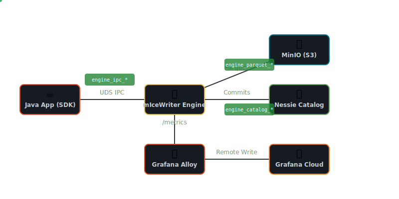

# mIceWriter Observability & Telemetry

To ensure robust operations and avoid the "catastrophic performance degradation" of creating millions of tiny S3 files, the mIceWriter engine heavily monitors its own internal thresholds and provides a suite of custom metrics. 

These metrics are designed to be ingested by Prometheus (via Grafana Alloy) and visualized in Grafana Cloud.

## The Metrics Architecture



mIceWriter exposes a lightweight Prometheus `/metrics` endpoint on the Axum debug server. This allows us to track both internal operations and the IPC (Inter-Process Communication) interface without introducing any noticeable overhead on the ingestion hot-path. 

We use atomic counters (`AtomicU64`) to ensure zero lock contention when metrics are incremented inside the multi-threaded ingestion pipeline.

## Custom Engine Metrics

The engine provides the following custom Prometheus metrics:

| Metric Name | Type | Labels | Description |
| :--- | :--- | :--- | :--- |
| `engine_parquet_files_written_total` | Counter | None | Total number of Parquet file objects written to MinIO/S3. |
| `engine_parquet_bytes_written_total` | Counter | None | Total size of Parquet files written in bytes. |
| `engine_catalog_commits_total` | Counter | None | Number of successful append commits made to the Nessie catalog. |
| `engine_ipc_requests_total` | Counter | `type` | Number of requests received from the SDK (e.g. `register_schema`, `ingest_record`, `flush_now`). |
| `engine_ipc_responses_total` | Counter | `status` | Number of responses sent back to the SDK (e.g. `ok`, `error`). |

## Grafana Dashboard Overview

The official mIceWriter Grafana dashboard provides a single pane of glass to monitor both the business metrics (Parquet flushes) and the hardware utilization (cAdvisor metrics) of the entire data pipeline. 

The dashboard includes the following 8 critical visualizations:

1. **Parquet Files Written to MinIO**: Shows both the throughput rate in Bytes/sec and Files/sec. Extremely useful for validating the 10-minute/32 MB batching behavior.
2. **Nessie Catalog Commits**: The rate of commits hitting the Iceberg catalog.
3. **SDK Calls to Engine**: Breakdown of IPC traffic types (Ingestion vs Schema Registration).
4. **Engine Responses to SDK**: Success vs Error rates for the IPC traffic.
5. **CPU and Memory Usage (Engine Container)**: Hardware footprint of the Rust engine.
6. **CPU and Memory Usage (Nessie Container)**: Hardware footprint of the Java catalog server.
7. **CPU and Memory Usage (MinIO Container)**: Hardware footprint of the object storage.
8. **CPU and Memory Usage (Sandbox Container)**: Hardware footprint of the overarching application orchestrating the traffic.

*(Note: Hardware footprint panels utilize a dual Y-axis layout so the gigabytes of memory do not visually crush the CPU core metrics. Engine responses use regex overrides to permanently color map `ok` to green and `error|reject` to red.)*

## Setting Up Grafana Cloud

To deploy the dashboard:
1. Copy the `grafana-dashboard.json` file from the `k8s` directory in `micewriter-sandbox`.
2. Import it into your Grafana Cloud instance.
3. Ensure your local Kubernetes cluster has Grafana Alloy (or another Prometheus agent) configured to scrape pod metrics and Remote Write them to your Grafana Cloud endpoint.

## Connecting an AI Agent (Grafana MCP)

Several AI workflows in this repo — notably [`skills/run-load-test-sweep.md`](../skills/run-load-test-sweep.md) and the automation pointers in [`load-testing-spec.md`](load-testing-spec.md) §5.2 / §6 — expect an AI agent connected to the **Grafana MCP server**, which exposes tools like `list_datasources`, `query_prometheus`, and `query_loki_logs`.

Use Grafana's hosted endpoint at `https://mcp.grafana.com/mcp` (streamable HTTP, OAuth). Register it once per machine in Claude Code user scope:

```powershell
claude mcp add --scope user --transport http `
    grafana https://mcp.grafana.com/mcp `
    --header "X-Grafana-URL: https://<your-stack>.grafana.net"
```

First connect opens a browser for OAuth consent against Grafana Cloud — no service account token to manage. The same registration is reused by every `micewriter-*` checkout.
