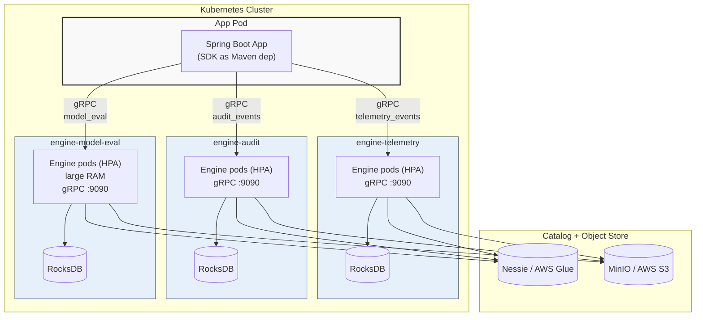
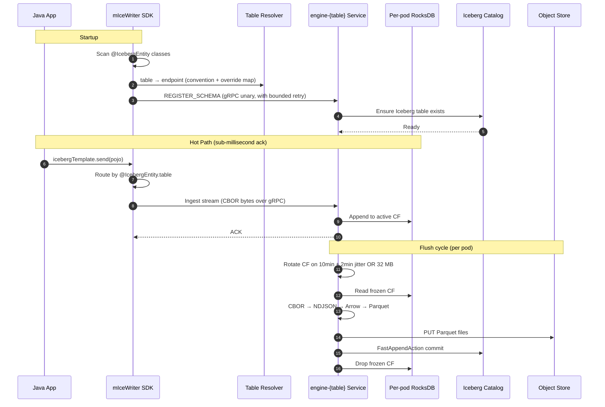

# 🛤️ v2: Per-Table Engine Pipelines
> 🌐 Part of the **[mIceWriter Telemetry Ingestion Ecosystem](file:///c:/Users/marko/source/repos/micewriter-hub/README.md)**

[](file:///c:/Users/marko/source/repos/micewriter-hub/README.md)
[](#)
[](#)

This document describes **v2** of the mIceWriter ingestion architecture: **one engine `Deployment` + `Service` per Iceberg table**, replacing the v1 per-pod sidecar topology. The Java SDK routes each `send(pojo)` to the correct pipeline using the existing `@IcebergEntity(table = "...")` annotation. New pipelines are provisioned by Helm release; new tables are expected infrequently.

> 📜 **Looking for v1?** The per-pod sidecar variant is an actively maintained release line on the `v1` branch of every `micewriter-*` repo (`v1.0.0` tags the original snapshot). See [v1-to-v2-migration.md](v1-to-v2-migration.md) for the pivot rationale.

## 1. Topology



Each pipeline owns exactly one Iceberg table. The engine binary is pinned to a single table at startup via `MICEWRITER_TABLE`; it processes only records destined for that table and commits only to that table. Pipelines are independent — no cross-pipeline coordination, no shared state.

## 2. End-to-end data flow



## 3. Wire protocol

The wire format keeps the v1 CBOR payload shape; **transport changes from UDS to gRPC over HTTP/2**. The existing per-record `[u16 table_name_len][table_name UTF-8][CBOR bytes]` framing is unchanged — the engine still validates that incoming records match the table it was pinned to at startup, rejecting cross-table writes.

| RPC | Direction | Payload | Notes |
|---|---|---|---|
| `RegisterSchema` | SDK → Pipeline | JSON `{ table, namespace, fields }` | Unary; called once per `@IcebergEntity` class at app startup. Bounded retry on unreachable pipeline. |
| `Ingest` | SDK → Pipeline | Streaming CBOR records | Bidi streaming over a long-lived channel. ACK per record. |
| `FlushNow` | SDK → Pipeline | Empty | Unary; only honored when `ENABLE_MANUAL_FLUSH=true`. Test environments only. |

The 16 MB per-payload cap and the CBOR-DOM amplification reasoning from v1 still apply — see [system-overview.md §2](system-overview.md).

## 4. SDK table-to-endpoint routing

The SDK reads `@IcebergEntity(table = "...")` off each POJO class (already done at schema registration) and looks up the pipeline endpoint via two layered config knobs:

```yaml
micewriter:
  # Convention template — applied to every table not in overrides
  resolver: "engine-{table}.micewriter.svc:9090"

  # Explicit overrides for tables that don't fit the convention
  # (legacy hyphenated names, cross-namespace pipelines)
  resolverOverrides:
    legacy-orders-v1: "engine-legacy-orders.legacy.svc:9090"
    cross-ns-events:  "engine-events.shared-data.svc:9090"
```

`ManagedChannel` instances are lazy-created per resolved endpoint and cached for the lifetime of the SDK. gRPC's native keepalive and reconnect handle transport blips — there is no equivalent of the v1 `UdsConnection` reconnect bug.

## 5. Lifecycle & failure modes

| Event | Behavior |
|---|---|
| **Pipeline unreachable at app startup** | `RegisterSchema` retries with exponential backoff for `MICEWRITER_REGISTER_RETRY_SECONDS` (default 30s), then proceeds. First `send()` per affected table retries registration before its first record. App never blocks indefinitely. |
| **Pipeline unreachable during `send()`** | Bounded retry with exponential backoff for `MICEWRITER_SEND_RETRY_SECONDS` (default 30s), then throws with the unresolvable table named. No unbounded SDK buffering (preserves JVM-heap-pressure guarantee). |
| **Engine pod restart (HPA scale, deploy, OOM)** | gRPC channel transparently re-establishes via native retry policy. In-flight records on the dying pod are flushed via `SIGTERM` emergency drain; records not yet ACKed by the SDK are re-sent on the new channel. |
| **Whole-pipeline outage** | `send()` calls to that table fail fast after the retry budget. Other tables' pipelines unaffected. |
| **App pod restart** | SDK re-registers schemas with each pipeline on startup. No persistent state in the SDK. |

## 6. Auth between SDK and pipelines

Default: **plain gRPC over the cluster network**. The chart ships with no auth requirement; pipelines trust their cluster's pod-to-pod network.

For zero-trust adopters, mTLS is added as a **service-mesh overlay** without SDK changes. The recommended path is Istio or Linkerd `PeerAuthentication` + `DestinationRule` resources on the pipeline Services. SPIRE/SPIFFE workload identity in the SDK and ServiceAccount-token authentication are deferred until an adopter explicitly requests them.

## 7. Scaling characteristics

| Axis | v1 sidecar | v2 per-table pipeline |
|---|---|---|
| Engine count per table | = app pod count | HPA on CPU/memory, decoupled from apps |
| Vertical sizing (RAM/CPU) | Same for every table | **Per-table** — small audit pipelines get small pods; large-payload tables get headroom |
| Engine upgrade | Recycle every app pod | Roll one pipeline; other tables untouched |
| Catalog commit contention | Across all sidecars, same table | **Bounded to one pipeline's pod count per table** |
| Blast radius of engine bug | Per app pod | **Per table** — other pipelines unaffected |
| Adding a new table | Pure catalog op | Helm release + catalog op (one-time per table) |

**HPA signal:** v2.0 uses default CPU/memory metrics for simplicity. CPU is a lagging signal (spikes during flush, not ingest) and memory tracks RocksDB CF growth which is a decent flush-imminent proxy. If load testing shows CPU/memory reacts too slowly to bursts, the upgrade path is KEDA + PromQL against Grafana Cloud (`micewriter_rocksdb_cf_bytes`, `rate(micewriter_ingest_records_total[1m])`) — no SDK or engine changes required.

## 8. Catalog commits with multiple pods per pipeline

With HPA, a pipeline can have N engine pods all running their own flush loop and committing to the same Iceberg table. v2.0 relies on `FastAppendAction`'s built-in `CommitFailedException` + exponential backoff to resolve optimistic-locking conflicts. Cleanly handles small N (~2–5 pods per pipeline) with zero added infrastructure.

**Known limit:** retry storms get expensive above ~10 pods per table.

**Upgrade path (v2.x):** if load testing shows hot tables hitting commit-retry contention, add leader election within the Deployment via a Kubernetes `Lease` resource — one pod commits, others forward compiled Parquet for batched commit. Deferred until measurements justify it.

## 9. Operating a pipeline

A pipeline is a Helm release of the `micewriter-table-pipeline` chart (in `micewriter-local-infra/charts/table-pipeline`), parameterized per Iceberg table:

```sh
helm install engine-telemetry-events ./charts/table-pipeline \
  --namespace micewriter \
  --set table=telemetry_events \
  --set namespace=analytics \
  --set resources.requests.memory=512Mi \
  --set resources.limits.memory=2Gi \
  --set replicas.min=1 \
  --set replicas.max=5 \
  --set flush.windowSeconds=600 \
  --set flush.sizeBytes=33554432
```

Each release provisions a `Deployment`, `Service`, and `HorizontalPodAutoscaler` named after the table.

## 10. Adopter onboarding

For a Spring Boot or Dropwizard app to start writing to a new Iceberg table:

1. **Define the POJO with the annotation:**
   ```java
   @IcebergEntity(table = "telemetry_events", namespace = {"analytics"})
   public class TelemetryEvent {
       @IcebergId private String id;
       private String source;
       private Instant occurredAt;
   }
   ```

2. **Platform team provisions the pipeline** (one Helm release per table — see §9).

3. **App config points at the resolver:**
   ```yaml
   micewriter:
     resolver: "engine-{table}.micewriter.svc:9090"
   ```

4. **Inject the template and send:**
   ```java
   @Autowired IcebergStreamTemplate icebergTemplate;
   icebergTemplate.send(new TelemetryEvent(...));
   ```

There is no Kubernetes annotation, no sidecar to inject, no per-pod PVC to provision. The v1 `micewriter-k8s-injector` admission webhook is sunset in v2.

## 11. What does not change from v1

- The append-only contract — Puffin deletion vectors and merge-on-read are still out of scope; deferred to async Iceberg maintenance jobs
- The 16 MB per-payload cap, driven by CBOR → `serde_json::Value` DOM amplification during the `arrow-json` parse step
- The hybrid time/size flush (jittered 10 min ± 2 min OR 32 MB) within each pipeline pod
- SIGTERM emergency flush on pod termination
- `ENABLE_MANUAL_FLUSH=true` IPC command for non-production integration tests
- Best-effort durability — records not yet flushed survive only as long as the engine pod survives. Pods that die before SIGTERM drain completes lose RocksDB-buffered records.

---
### 🔗 The mIceWriter Ecosystem

**🎯 Why:**
* [Motivation & target adopter](why.md)

**🛠️ What:**
* [System overview & wire protocol](system-overview.md)
* [v2: Per-table pipelines](per-table-pipelines.md) — *this doc*
* [v1 → v2 migration rationale](v1-to-v2-migration.md)
* [Rust engine internals](micewriter-engine.md) — *describes v1; v2 retains the flush internals*
* [Java SDK](micewriter-sdk-java.md)

**🔬 Is it viable?**
* [Feasibility evaluation](feasibility.md)
* [Getting started (local deploy)](getting-started.md)
* [Local infrastructure](micewriter-local-infra.md)
* [Reference sandbox app](micewriter-sandbox.md)
* [Load testing specification](load-testing-spec.md)

**📊 Use:**
* [Querying Iceberg tables](querying.md)
