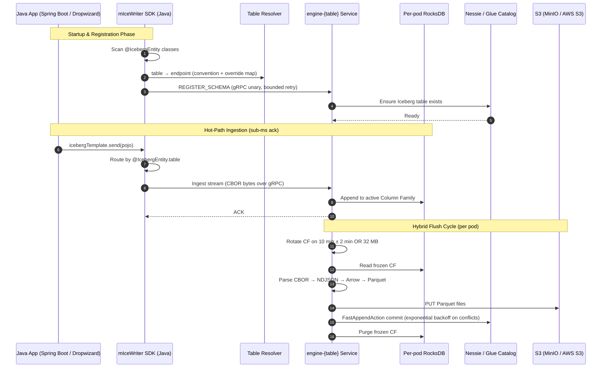

# 🌐 System Overview
> 🌐 Part of the **[mIceWriter Telemetry Ingestion Ecosystem](file:///c:/Users/marko/source/repos/micewriter-hub/README.md)**

This document outlines the core architecture and data flows for the mIceWriter telemetry ingestion pipeline as of **v2: per-table engine pipelines**. The v1 sidecar variant is an actively maintained release line on the `v1` branch of every `micewriter-*` repo (`v1.0.0` tags the original snapshot). See [v1-to-v2-migration.md](v1-to-v2-migration.md) for the pivot rationale.

## 1. Global Architecture & Topology

v2 replaces the v1 per-pod sidecar with **one engine `Deployment` + `Service` per Iceberg table**. The Java SDK routes each `send(pojo)` to the correct pipeline using the existing `@IcebergEntity(table = "...")` annotation. Pipelines are independent: HPA, resource sizing, and catalog commits are scoped per table.

A pipeline is a Helm release of the `micewriter-table-pipeline` chart parameterized by `table`, resource budget, replica counts, and flush thresholds. The engine binary is the same across all pipelines but is pinned to one table at startup via `MICEWRITER_TABLE`.

See [per-table-pipelines.md](per-table-pipelines.md) for the full v2 design, including resolver configuration, scaling characteristics, and the upgrade paths for HPA signal and commit contention.

## 2. gRPC Transport & Routing

Communication between `micewriter-sdk-java` and the per-table pipelines runs over **gRPC over HTTP/2**. The wire payload keeps the v1 CBOR shape; only the transport changes.

### 2.1 Framing
gRPC handles framing. The application-layer payload retains the v1 per-record shape: `[u16 table_name_len][table_name UTF-8][CBOR bytes]`. The engine validates that incoming records match the table it was pinned to at startup and rejects cross-table writes.

### 2.2 RPCs

| RPC | Direction | Payload | Notes |
|---|---|---|---|
| `RegisterSchema` | SDK → Pipeline | JSON `{ table, namespace, fields }` | Unary; called once per `@IcebergEntity` class at app startup. Bounded retry on unreachable pipeline. |
| `Ingest` | SDK → Pipeline | Streaming CBOR records | Bidi streaming over a long-lived channel. ACK per record. |
| `FlushNow` | SDK → Pipeline | Empty | Unary; honored only when `ENABLE_MANUAL_FLUSH=true` (non-production). |

### 2.3 Serialization
- **Schemas (`RegisterSchema`)** are JSON.
- **Telemetry records (`Ingest`)** are native CBOR bytes — keeping the SDK stateless, no Arrow schema dictionary per row, framework-agnostic for Spring Boot / Dropwizard.
- **Engine pipeline (`CBOR → NDJSON → Arrow → Parquet`):** because there is no battle-tested `arrow-cbor` parser in the Apache Arrow ecosystem, the engine transpiles CBOR into NDJSON just-in-time, then leverages `arrow-json` to rigorously enforce Iceberg schemas and manage complex nested memory (validity bitmaps, nested lists, etc.).
- **Payload limit:** hard-capped at **16 MB** at both SDK and engine. A 16 MB monolithic CBOR array of floats can expand into 200+ MB of `serde_json::Value` DOM in Rust — threatening the engine pod's memory limit during `arrow-json` parsing.

### 2.4 Table → Endpoint Resolution
The SDK reads `@IcebergEntity.table` from each POJO class and resolves it to a pipeline endpoint via a layered config:

- `MICEWRITER_RESOLVER` template (default `engine-{table}.micewriter.svc:9090`) — applied to every table that fits the convention.
- `MICEWRITER_RESOLVER_OVERRIDES` map — explicit `table → endpoint` entries for legacy hyphenated names, cross-namespace pipelines, or migration scenarios.

`ManagedChannel` instances are lazy-created per resolved endpoint and cached for the lifetime of the SDK. gRPC's native keepalive and reconnect handle transport blips.

### 2.5 Auth
Default is **plain gRPC over the cluster network** — the chart ships with no auth requirement. For zero-trust adopters, mTLS is added as a service-mesh overlay (Istio / Linkerd `PeerAuthentication` + `DestinationRule`) without SDK changes.

## 3. The Flush Cycle & Graceful Shutdown

To consolidate small records into optimized Iceberg v3 Parquet files while protecting the catalog API from rate limits (the "thundering herd" problem):

- **Hybrid time/size Column Family swap.** Each engine pod rotates its active RocksDB Column Family and freezes the old one for compilation either on a jittered schedule (~10 minutes ± 2 minutes) OR immediately if uncompressed CF data exceeds 32 MB. The 32 MB ceiling keeps compiled Parquet bytes held in memory under ~15 MB, protecting the pod's memory limit.
- **Compilation.** Frozen CBOR records are decoded into NDJSON, dynamically cast using the Iceberg schema via `arrow-json`, and compiled into Parquet file batches. The engine performs fast, append-only operations — Puffin deletion vectors and row-level updates are deferred to async Iceberg maintenance jobs outside the pipeline.
- **Catalog commit.** The pipeline uploads Parquet files to S3 (MinIO or AWS S3) and executes an atomic `FastAppendAction` commit against the catalog (Nessie or AWS Glue). On `CommitFailedException` (optimistic-locking conflict from another pod in the same pipeline), exponential backoff retry resolves the conflict.
- **SIGTERM emergency flush.** When Kubernetes terminates an engine pod (HPA scale-down, rolling update, eviction), the pod intercepts SIGTERM, pauses new ingestion, forces an immediate compilation/commit of its remaining RocksDB data, and exits.
- **Manual flush (testing only).** In non-production environments, `ENABLE_MANUAL_FLUSH=true` enables the `FlushNow` RPC for end-to-end integration tests. Disabled in production to protect the catalog from API abuse.

> ⚠️ **Per-pipeline commit contention:** with HPA, a pipeline may have N pods committing concurrently. v2.0 relies on optimistic-locking retry; for hot tables that hit the contention wall (~10+ pods), the upgrade path is leader election via a Kubernetes `Lease` within the Deployment. Tracked as a v2.x consideration in [per-table-pipelines.md §8](per-table-pipelines.md).

## 4. Downstream Analytics Readers

This architecture intentionally separates **write optimization** from **read-after-write** concerns. The system is split into two optimized domains:

1. **Write optimization.** Application achieves sub-millisecond write latency via gRPC to a per-table pipeline, insulated from cloud catalog/S3 latency. Each pipeline is sized for its table's payload shape.
2. **Read optimization.** Distributed query engines (Trino, Apache Superset, Athena, Spark) require large, columnar files to execute analytical queries efficiently. By delaying the Iceberg catalog commit until each pipeline has compiled ~10 minutes (or 32 MB) of telemetry into larger Parquet files, downstream analytics platforms are saved from the catastrophic performance degradation of scanning millions of tiny S3 files.

Per-table isolation means hot tables can independently scale to bigger flush windows or larger pod RAM without affecting cold tables sharing the same cluster.

---
### 🔗 The mIceWriter Ecosystem

**🎯 Why:**
* [Motivation & target adopter](why.md)

**🛠️ What:**
* [System overview & wire protocol](system-overview.md)
* [v2: Per-table pipelines](per-table-pipelines.md)
* [v1 → v2 migration rationale](v1-to-v2-migration.md)
* [Rust engine internals](micewriter-engine.md)
* [Java SDK](micewriter-sdk-java.md)

**🔬 Is it viable?**
* [Feasibility evaluation](feasibility.md)
* [Getting started (local deploy)](getting-started.md)
* [Local infrastructure](micewriter-local-infra.md)
* [Reference sandbox app](micewriter-sandbox.md)
* [Load testing specification](load-testing-spec.md)

**📊 Use:**
* [Querying Iceberg tables](querying.md)
