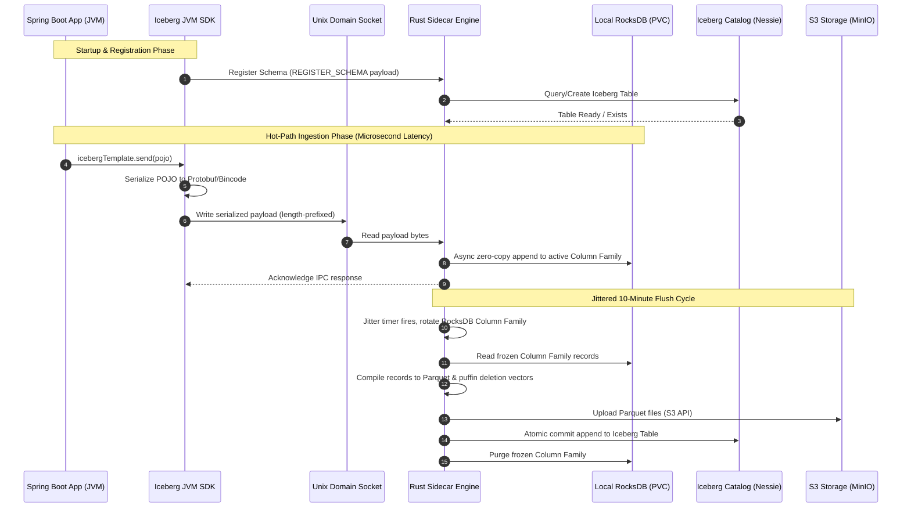

# System Overview

This document outlines the core architecture and data flows for the distributed Iceberg ingestion pipeline.

## 1. Global Architecture & Topology

The system operates entirely within the Kubernetes pod networking boundary, ensuring zero network latency for the business application during data emission. The architecture uses a sidecar pattern to decouple the application JVM from storage operations.

## 2. Unix Domain Socket (UDS) Protocol & IPC

Communication between the Spring Boot SDK and the Rust sidecar occurs over a shared Unix Domain Socket located at `/var/run/app/iceberg.sock`.

### 2.1 Packet Structure
All IPC messages use a standard 4-byte big-endian length prefix framing protocol to ensure the Rust Tokio runtime can efficiently read complete messages off the stream without blocking.
- **Bytes [0-3]:** Total Message Length `N` (Unsigned 32-bit Integer, Big Endian)
- **Bytes [4 to N+4]:** The serialized payload.

### 2.2 Serialization
- **Schemas:** Handshake messages (`REGISTER_SCHEMA`) are sent as JSON.
- **Telemetry Records:** Hot-path ingestion records (`INGEST_RECORD`) are serialized via Bincode or Protobuf before transmission to ensure maximum throughput and minimal allocation overhead.

## 3. The Flush Cycle & Graceful Shutdown

To consolidate small records into optimized Iceberg v3 Parquet files while protecting the Catalog API from rate limits (the "Thundering Herd" problem):

- **Jittered Column Family Swap:** The Rust cron thread wakes up on a randomized (jittered) schedule (e.g., 10 minutes ± 2 minutes). It swaps incoming traffic to a new RocksDB Column Family, freezing the old one.
- **Compilation:** The frozen records are compiled into Parquet and `.puffin` files.
- **Catalog Commit:** The sidecar uploads files to S3 (MinIO) and executes an atomic commit to Nessie. On `CommitFailedException` (optimistic locking failure), it uses an exponential backoff retry.
- **SIGTERM Emergency Flush:** If Kubernetes initiates pod termination, the sidecar intercepts the `SIGTERM` signal, pauses new ingestion, forces an immediate compilation/commit of remaining RocksDB data, and exits safely.
