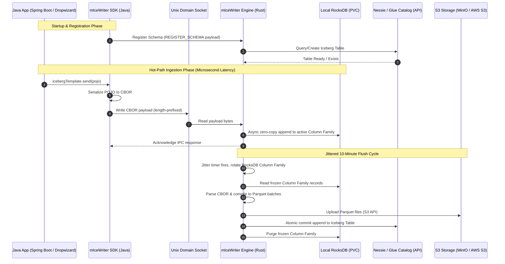

# 🌐 System Overview
> 🌐 Part of the **[mIceWriter Telemetry Ingestion Ecosystem](file:///c:/Users/marko/source/repos/micewriter-hub/README.md)**

This document outlines the core architecture and data flows for the distributed mIceWriter telemetry ingestion pipeline.

## 1. Global Architecture & Topology

The system operates entirely within the Kubernetes pod networking boundary, ensuring zero network latency for the business application during data emission. The architecture uses a sidecar pattern to decouple the application JVM from storage operations.

## 2. Unix Domain Socket (UDS) Protocol & IPC

Communication between the `micewriter-sdk-java` and the `micewriter-engine` occurs over a shared Unix Domain Socket located at `/var/run/app/iceberg.sock`.

### 2.1 Packet Structure
All IPC messages use a standard 4-byte big-endian length prefix framing protocol to ensure the Rust Tokio runtime can efficiently read complete messages off the stream without blocking.
- **Bytes [0-3]:** Total Message Length `N` (Unsigned 32-bit Integer, Big Endian)
- **Bytes [4 to N+4]:** The serialized payload.

### 2.2 Serialization
- **Schemas:** Handshake messages (`REGISTER_SCHEMA`) are sent as JSON.
- **Telemetry Records:** Hot-path ingestion records (`INGEST_RECORD`) are streamed as native **CBOR (Concise Binary Object Representation)** bytes. This dynamic binary format eliminates the Arrow schema repetition on every row, keeping the SDK entirely memory-free, while natively supporting large binary tensor arrays without Base64 overhead. The payload size is capped at 128 MB to prevent OOM attacks.

## 3. The Flush Cycle & Graceful Shutdown

To consolidate small records into optimized Iceberg v3 Parquet files while protecting the Catalog API from rate limits (the "Thundering Herd" problem):

- **Jittered Column Family Swap:** The Rust cron thread wakes up on a randomized (jittered) schedule (e.g., 10 minutes ± 2 minutes). It swaps incoming traffic to a new RocksDB Column Family, freezing the old one.
- **Compilation:** The frozen CBOR records are decoded, dynamically cast using the Iceberg schema, and compiled into Parquet file batches. Note: The engine performs fast, append-only operations; Puffin deletion vectors and row-level updates are deferred to asynchronous Iceberg maintenance jobs.
- **Catalog Commit:** The sidecar uploads files to S3 (MinIO or AWS S3) and executes an atomic commit to the configured catalog (Nessie or AWS Glue). On `CommitFailedException` (optimistic locking failure), it uses an exponential backoff retry.
- **SIGTERM Emergency Flush:** If Kubernetes initiates pod termination, the sidecar intercepts the `SIGTERM` signal, pauses new ingestion, forces an immediate compilation/commit of remaining RocksDB data, and exits safely.
- **Manual Flush (Testing Only):** In non-production environments, the injector configures `ENABLE_MANUAL_FLUSH=true`, exposing an IPC command to manually force a flush. This enables end-to-end integration tests while remaining disabled in production to protect the Catalog from API abuse.

## 4. Downstream Analytics Readers

This architecture intentionally abstracts away **read-after-write** capabilities from the emitting Spring Boot application. The system is fundamentally split into two optimized domains:

1. **Write Optimization:** The application achieves microsecond write latency via UDS and local RocksDB caching, completely insulated from cloud API latency.
2. **Read Optimization:** Distributed query engines (e.g., **Trino, Apache Superset, Athena, Spark**) require large, columnar files to execute analytical queries efficiently. By delaying the Iceberg catalog commit until the sidecar has compiled 10 minutes worth of telemetry into large Parquet files, downstream analytics platforms are saved from the catastrophic performance degradation of scanning millions of tiny S3 files.

---
### 🔗 The mIceWriter Ecosystem

**🎯 Why:**
* [Motivation & target adopter](why.md)

**🛠️ What:**
* [System overview & IPC protocol](system-overview.md)
* [Rust sidecar engine](micewriter-engine.md)
* [Java SDK](micewriter-sdk-java.md)
* [Kubernetes injector](micewriter-k8s-injector.md)

**🔬 Is it viable?**
* [Feasibility evaluation](feasibility.md)
* [Getting started (local deploy)](getting-started.md)
* [Local infrastructure](micewriter-local-infra.md)
* [Reference sandbox app](micewriter-sandbox.md)
* [Load testing specification](load-testing-spec.md)

**📊 Use:**
* [Querying Iceberg tables](querying.md)
