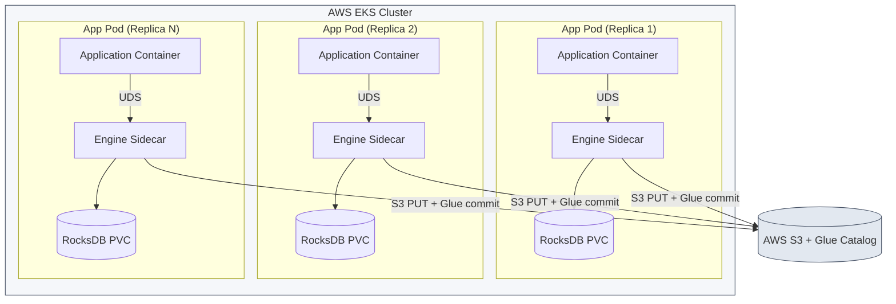

# 🎯 Why mIceWriter Exists
> 🌐 Part of the **[mIceWriter Telemetry Ingestion Ecosystem](file:///c:/Users/marko/source/repos/micewriter-hub/README.md)**

[](file:///c:/Users/marko/source/repos/micewriter-hub/README.md)
[](#)

This document explains the problem mIceWriter exists to solve, who it is for, what it deliberately does not do, and how it is shaped for production. If you are deciding whether to adopt the sidecar in your own application, start here.

---

## 1. The problem

Application teams running on AWS EKS want to persist data to **Apache Iceberg** tables (catalog: AWS Glue; storage: S3) for downstream analytics, ML training pipelines, and audit. The straightforward approach — have each application write directly to Iceberg from its own JVM — runs into four concrete pains.

### 1.1 S3 latency on the hot path
Object-store APIs operate in tens-to-hundreds of milliseconds per write. Request-handler code paths or model-inference pipelines that need to emit telemetry at microsecond budgets cannot block on an S3 PUT. Wrapping the write in an async executor inside the JVM trades one problem for another: now the application is responsible for retries, backpressure, in-process queueing, and graceful drain on shutdown.

### 1.2 JVM heap pressure on big payloads
Some of the records teams want to persist are **not small**. Model-evaluation traces and tensor-bearing audit events run **10–30 MB per record**. If the application buffers a few thousand of these in its own JVM heap before flushing, the buffer competes with the application's actual work for memory — and an `OutOfMemoryError` kills the application, not a sidecar.

### 1.3 The small-files problem on the read side
If every record becomes its own Parquet file, the Iceberg table accumulates millions of tiny files over time. Distributed query engines (Athena, Trino, Spark) suffer catastrophic performance degradation scanning that file count — metadata overhead dwarfs the actual scan. Some form of write-side consolidation is required, but doing it inside each application means every team re-implements the same batching, sizing, and flush-cadence logic.

### 1.4 Catalog write coupling
Direct Iceberg writes from each application replica mean every replica must hold catalog credentials, manage commit retries on `CommitFailedException` (optimistic-locking failure), and coordinate to avoid contention. Concentrating that responsibility in one place per pod removes the complexity from application code entirely.

---

## 2. The solution

A **per-pod sidecar** — the [`micewriter-engine`](micewriter-engine.md) — that the application talks to over a Unix Domain Socket inside the pod boundary. The application emits records at microsecond latency; the sidecar absorbs them into a local RocksDB buffer; a jittered background flush consolidates roughly 10 minutes of records into appropriately-sized Parquet files and atomically commits them to the Iceberg catalog.

This shifts every one of the four pains:

| Pain | Where it goes |
|---|---|
| **S3 latency** | Out of the hot path entirely. The UDS write returns in microseconds. |
| **JVM heap pressure** | Off the JVM. Records leave the application as CBOR bytes; buffering happens in RocksDB on a dedicated ephemeral PVC. |
| **Small files** | Solved at the platform layer. The 10-minute flush window batches records into Parquet files sized for analytics. |
| **Catalog coupling** | One sidecar per pod owns the Glue (or Nessie) commit, with exponential backoff on optimistic-lock failures. |

> 👉 **Want to see how this is built?** Jump to the **[system overview](system-overview.md)** for the full data flow, IPC protocol, and flush-cycle design — then come back to §3 below for the adoption decision.

---

## 3. Who this is for

The intended adopter is **another team running a Spring Boot or Dropwizard application on AWS EKS** that wants Iceberg persistence without taking on the four pains above. Adoption is a single pod annotation:

```yaml
metadata:
  annotations:
    iceberg-stream.micewriter.io/inject: "true"
```

The [mutating webhook](micewriter-k8s-injector.md) injects the engine sidecar container, the shared UDS volume, and the RocksDB ephemeral PVC. The application adds the [Java SDK](micewriter-sdk-java.md) as a dependency, annotates its domain objects with `@IcebergEntity`, and calls `icebergTemplate.send(pojo)` from wherever a record needs to be persisted. No infrastructure code changes are required beyond those two surface-area decisions.

### Should you adopt this?

Run through this checklist. If you can't say "yes" to all five, talk to the platform team before annotating your pod:

1. **You need to persist records to Apache Iceberg** — not a queue, not a transactional database, not a search index. The sidecar is purpose-built for Iceberg and offers nothing for other destinations.
2. **Your records can tolerate ~10-minute write-to-queryable latency.** Data emitted via `icebergTemplate.send()` becomes queryable only after the next flush cycle commits to the catalog. If you need to read what you just wrote within seconds, use a different system.
3. **Your average payload is under ~10 MB, with occasional records up to ~30 MB.** Above this the engine's RocksDB buffer pressure grows faster than the default resource limits accommodate. Larger payloads are not categorically rejected, but they push you into territory the [feasibility evaluation](feasibility.md) has not validated.
4. **You're emitting fewer than ~500 records/sec per pod sustained.** *(Final per-pod throughput envelope set by [feasibility evaluation](feasibility.md) results.)* Higher rates may work but require explicit sizing and a re-run of the load test matrix for your specific payload shape.
5. **You don't need exactly-once durability across pod restarts.** A pod that dies before its SIGTERM emergency-flush completes can lose the records still in its RocksDB buffer. If every record must be durable from the moment of emit, the sidecar is not sufficient on its own — pair it with a synchronous write to a durable queue.

If your use case sits outside this envelope, the answer is not necessarily "no" — it's "talk first." The envelope reflects what the system has been validated for, not what it can theoretically support.

---

## 4. Non-goals

mIceWriter is deliberately narrow. The following are **out of scope** and applications needing them should look elsewhere:

- **Sub-10-minute read-after-write.** Records become queryable after the flush cycle commits to the catalog, not on emit. Applications that need live state (e.g., serving the same data they just wrote) should use a different system in parallel.
- **Row-level updates or deletes.** The engine is append-only. Puffin deletion vectors and merge-on-read are deferred to asynchronous Iceberg maintenance jobs run outside the sidecar.
- **Cross-pod coordination.** Each sidecar owns its pod's records and commits independently. There is no shared queue, no leader election, no fan-in across replicas.
- **Exactly-once durability across pod restarts.** A pod that dies before its `SIGTERM` emergency-flush completes can lose records still in the RocksDB buffer. Applications with stronger durability requirements should not use this system as their only persistence layer.
- **Schema changes without a pod restart.** `REGISTER_SCHEMA` runs once at startup. Adding or modifying `@IcebergEntity` classes requires redeploying the application pods to pick up the new schema.

---

## 5. Production deployment shape

In production EKS, a typical adopting application runs as a `Deployment` with N replicas. Each replica pod gets its own engine sidecar instance, its own RocksDB cache, and commits to Glue independently. **There is no fan-in** — the engine fleet's combined throughput is the sum of each sidecar's throughput, and the Iceberg table accumulates one snapshot per (pod × flush cycle).



This shape has two consequences:

1. **Per-pod resource cost is the unit of adoption.** Whether the engine is cheap enough to recommend to other teams is decided by what a single sidecar costs in CPU and memory at the team's expected payload size and event rate. Multiplying by N gives the fleet cost.
2. **Catalog commit pressure grows with N.** At very high replica counts, the number of concurrent Iceberg commits against the same table can become a contention point. This is not a per-sidecar property and is not addressed by the current evaluation — it requires a separate test against real AWS infrastructure at scale.

### Per-pod adoption envelope

> ⏳ **TBD — populated by load-test results.**
>
> The numbers below will be filled in once the [feasibility evaluation](feasibility.md) has completed its first full pass through the test matrix. Until then, the engine sidecar has **not been validated** at any specific throughput or payload combination, and adoption recommendations should be made conservatively.
>
> | Dimension | Validated envelope (per pod) |
> |---|---|
> | Sustained event rate | _TBD_ |
> | Average payload size | _TBD_ |
> | Peak payload size | _TBD_ |
> | CPU request / limit | _TBD_ |
> | Memory request / limit | _TBD_ |
> | RocksDB PVC size | _TBD_ |
>
> Source of truth for these values once measured: the results table in [load-testing-spec.md §6](load-testing-spec.md) and the injector defaults in [`micewriter-k8s-injector/charts/.../values.yaml`](micewriter-k8s-injector.md). Update this section when those land.

---

## 6. Is it actually viable?

The honest answer is *we don't know yet, and the entire local-infra + sandbox + load-testing setup in this ecosystem exists to find out before recommending the sidecar to anyone else.*

That evaluation is documented separately:

👉 **[Feasibility Evaluation](feasibility.md)**

---

### 🔗 The mIceWriter Ecosystem

**🎯 Why:**
* [Motivation & target adopter](why.md)

**🛠️ What:**
* [System overview & IPC protocol](system-overview.md)
* [Rust sidecar engine](micewriter-engine.md)
* [Java SDK](micewriter-sdk-java.md)
* [Kubernetes injector](micewriter-k8s-injector.md)

**🔬 Is it viable?**
* [Feasibility evaluation](feasibility.md)
* [Getting started (local deploy)](getting-started.md)
* [Local infrastructure](micewriter-local-infra.md)
* [Reference sandbox app](micewriter-sandbox.md)
* [Load testing specification](load-testing-spec.md)

**📊 Use:**
* [Querying Iceberg tables](querying.md)
